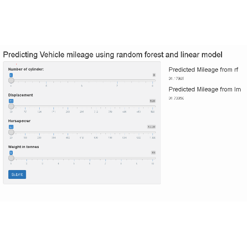

## Slide 2
The application allows users to input four values and then generates an estimate of mileage using Rpart and Linear Model.


```r
library(png)
img <- readPNG("D://R//Working_DIR//test//MyShinyApp//shiny2.PNG")
grid::grid.raster(img)
```



---

## Slide 3

Behind the scenes, the application uses "mtcars" data set to do the initial machine learning.

The models then estimate Mileage based on the values of number of cylinder, displacement, Horsepower and Weight.

---

## Slide 4

The app is useful to get an estimate of mileage for various combinations of cylinder, displacement, horsepower and weight. There by helping the user in deciding for the right vehicle. 

Since output is generated using "Random Forest" and "Linear Model", it also shows how much user can rely on estimated values.

Similar estimates from both the models, increases user confidence in the estimated value.

